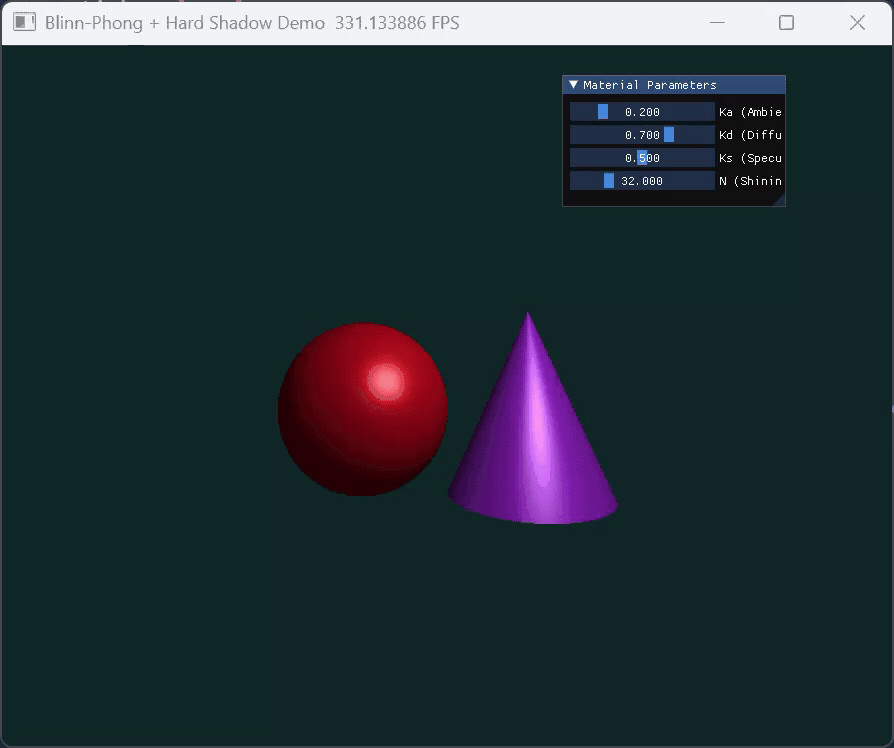

# Phong 光照模型实验（Taichi 实现）

## 📌 项目简介

本项目基于 Taichi 实现了经典的 **Phong 光照模型**，通过光线投射（Ray Casting）渲染三维场景中的球体与圆锥，并实现了交互式参数调节。同时，在基础模型上扩展实现了：

* ⭐ Blinn-Phong 高光模型
* ⭐ 硬阴影（Hard Shadow）

实现了更加真实的光照效果。

---

## 🎯 实验目标

* 理解局部光照模型（Ambient / Diffuse / Specular）
* 掌握三维向量计算（法向量、光照方向、视线方向）
* 掌握光线求交与深度测试方法
* 使用 Taichi 实现实时渲染与交互

---

## 🧠 实验原理

Phong 光照模型由三部分组成：

[
I = I_{ambient} + I_{diffuse} + I_{specular}
]

### 1️⃣ 环境光（Ambient）

模拟环境中的背景光：

[
I_{ambient} = K_a \cdot C_{light} \cdot C_{object}
]

---

### 2️⃣ 漫反射（Diffuse）

基于 Lambert 定律：

[
I_{diffuse} = K_d \cdot \max(0, N \cdot L) \cdot C_{light} \cdot C_{object}
]

---

### 3️⃣ 镜面高光（Specular）

传统 Phong：

[
I_{specular} = K_s \cdot \max(0, R \cdot V)^n
]

---

## 🏗️ 场景构建（必做）

### 几何体

* 🔴 球体

  * 中心：(-1.2, -0.2, 0)
  * 半径：1.2
  * 颜色：(0.8, 0.1, 0.1)

* 🟣 圆锥

  * 顶点：(1.2, 1.2, 0)
  * 底面：y = -1.4
  * 半径：1.2
  * 颜色：(0.6, 0.2, 0.8)

---

### 摄像机与光源

* 摄像机：`(0, 0, 5)`
* 光源：`(2, 3, 4)`
* 光源颜色：白色 `(1, 1, 1)`

---

## 🔍 光线求交与深度测试（必做）

对每个像素发射射线：

* 分别计算与球体、圆锥的交点
* 选择最近交点（最小正 t）
* 实现遮挡关系（类似 Z-buffer）

---

## 🎨 光照模型实现（必做）

在交点处计算：

* 法向量 N
* 光照方向 L
* 视线方向 V

最终颜色：

```python
color = ambient + diffuse + specular
```

并使用：

```python
ti.math.clamp(color, 0.0, 1.0)
```

限制颜色范围。

---

## 🎛️ UI 交互（必做）

提供实时调节参数：

| 参数        | 含义     | 范围      |
| --------- | ------ | ------- |
| Ka        | 环境光系数  | 0 ~ 1   |
| Kd        | 漫反射系数  | 0 ~ 1   |
| Ks        | 镜面反射系数 | 0 ~ 1   |
| Shininess | 高光指数   | 1 ~ 128 |

---

# 🚀 选做内容

## ⭐ 1. Blinn-Phong 模型

在本实验中，使用 **Blinn-Phong 模型**替代传统 Phong 高光计算。

### 实现方法

引入半程向量：

[
H = \frac{L + V}{|L + V|}
]

代码实现：

```python
H = normalize(L + V)
spec = max(0.0, N.dot(H)) ** shininess
```

---

### ✔ 效果对比

相比传统 Phong：

* 高光更加稳定
* 边缘更平滑
* 在大角度情况下表现更自然

---

## ⭐ 2. 硬阴影（Hard Shadow）

### 实现方法

在交点处向光源发射阴影射线（Shadow Ray）：

```python
shadow_dir = normalize(light_pos - hit_point)
```

判断射线在到达光源前是否与其他物体相交：

```python
if 0 < t < light_distance:
    in_shadow = True
```

---

### 阴影处理

```python
if in_shadow:
    color = ambient
else:
    color = ambient + diffuse + specular
```

---

### ✔ 效果

* 实现物体间遮挡关系
* 阴影边界清晰（硬阴影）
* 增强场景立体感

---

## 🧩 代码结构说明

```text
.
├── main.py
├── README.md
└── requirements.txt
```

主要模块：

* `intersect_sphere()`：球体求交
* `intersect_cone()`：圆锥求交
* `is_in_shadow()`：阴影检测（核心选做）
* `render()`：主渲染逻辑

---

## ⚙️ 运行方式

### 1 安装依赖

```bash
pip install -r requirements.txt
```

---

### 2 运行程序

```bash
python main.py
```

---

## 实验结果

运行后可观察到：

* 球体与圆锥的光照效果
* 表面高光（Blinn-Phong）
* 清晰的投影阴影
* 参数调节带来的实时变化



---

## 实验总结

本实验完成了：

* ✅ Phong 光照模型实现
* ✅ 光线求交与遮挡关系
* ✅ Taichi 实时渲染
* ✅ Blinn-Phong 高光优化
* ✅ 硬阴影实现

通过实验，加深了对计算机图形学中光照模型与光线追踪原理的理解。
